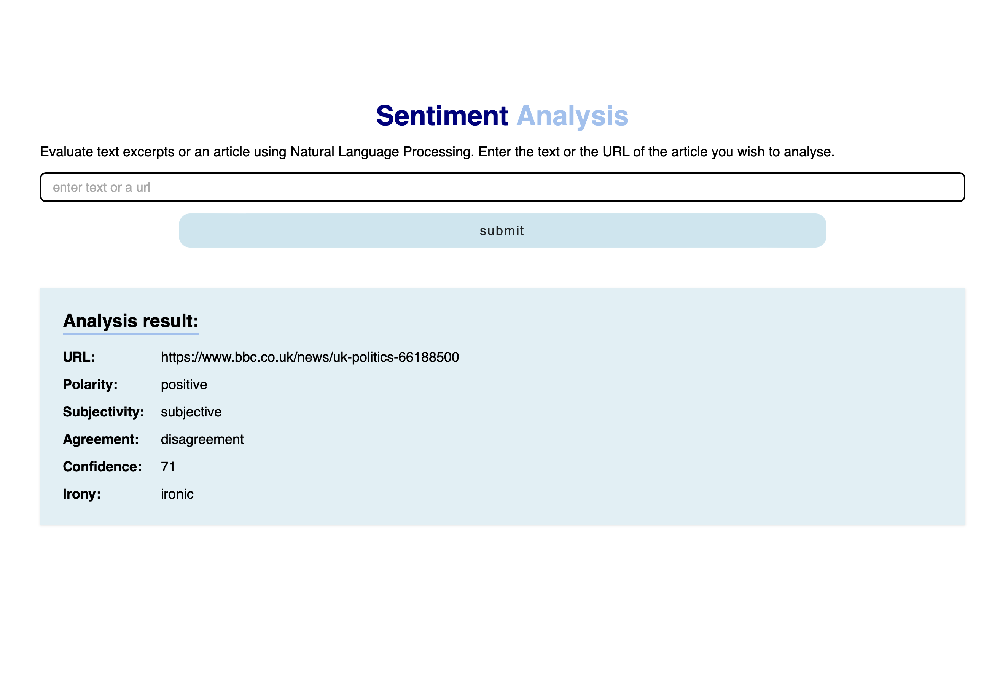
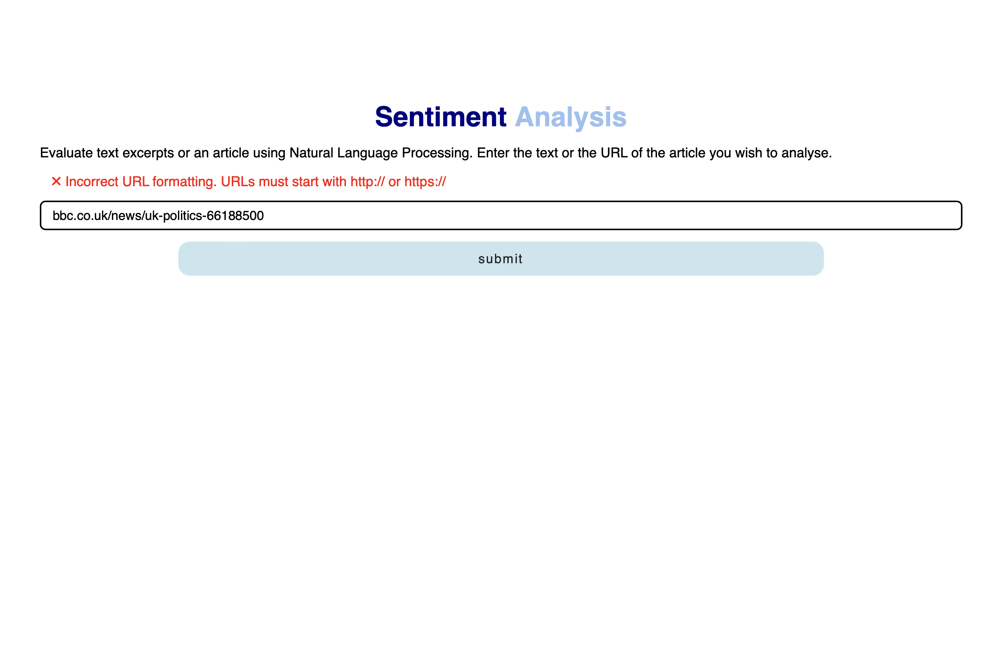

# Project 4: Evaluate a News Article with Natural Language Processing

Completed as part of Udacity's Front End Web Developer Nanodegree Program.

## Project description:
This project build a web tool that allows users to run Natural Language Processing (NLP) on articles or blogs found on other websites. It also takes in text excerpts. 

## Project Requirements: 
- Use webpack
- Make use of external API
- Have unit tests
- Use Sass
- Have offline functionality

## Tools used:
- [Meaning Cloud API](https://www.meaningcloud.com/products/sentiment-analysis)
- [Webpack](https://webpack.js.org)
- [Sass](https://sass-lang.com)
- [NodeJS](https://nodejs.org/en)
- [Express](https://expressjs.com)
- [Body-Parser](https://www.npmjs.com/package/body-parser)
- [Cors](https://www.npmjs.com/package/cors)
- Service Workers

## Preview
Desktop view of Sentiment Analysis App

Error view

## Get started
### Build the project
- `npm i` : install dependencies
- `npm run dev` : builds development version of the project
- `npm run prod` : builds production version
- `npm run test` : runs jest unit tests
- `npm start` : starts node server

### Run the project
1. Install all the dependencies in the `package.json`
2. Sign up for [Meaning Cloud API](https://www.meaningcloud.com/products/sentiment-analysis) to get API key.
3. `npm install dotenv` and create `.env` file in the root of your project and put your API key in there.
4. Start the server `npm start`
5. Run the development or production version of the project - `npm run prod` or `npm run test`
6. Go to http://localhost:8081 to use it